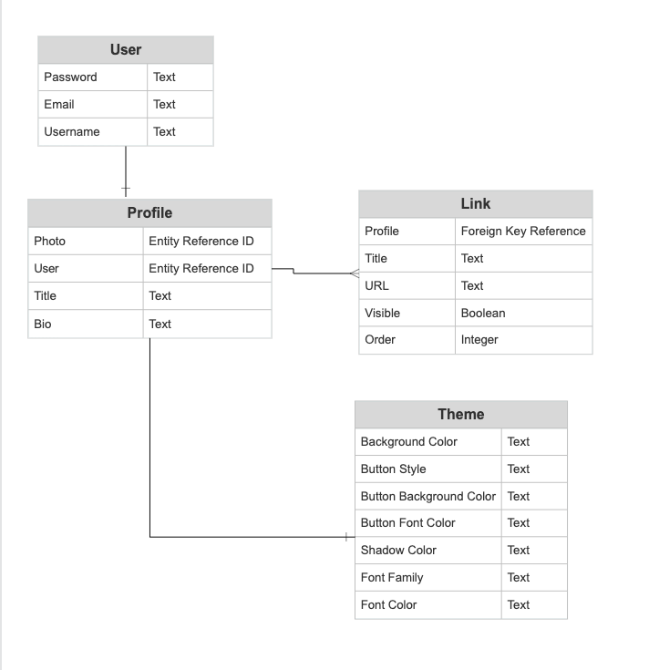
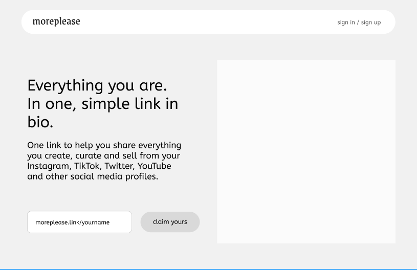
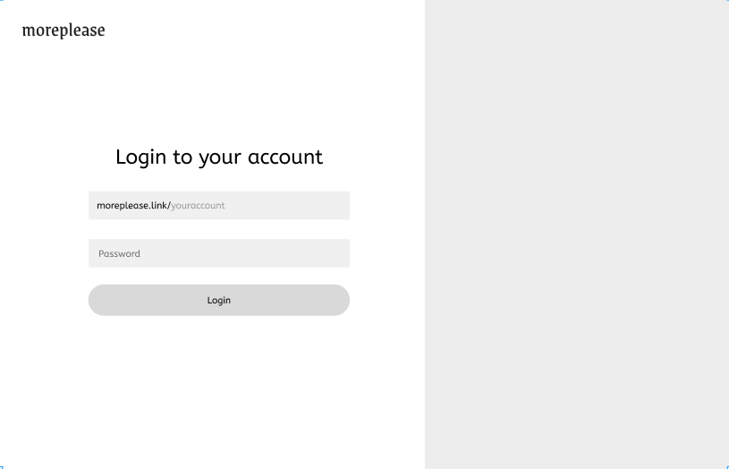
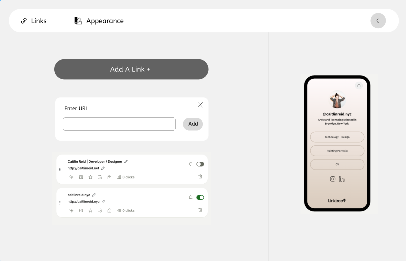

# More Please | Frontend

More Please is a static site generator in the style of Link-In-Bio/Linktree for social media apps.

## User Stories
As a user I want to: 
- Login in a create an account with a unique URL (moreplease.link/{username})
- Add a variety of media to my site generator, including: 
    Profile picture, bio, theme settings and links 
- Preview the site as its being generated
- Style the site with unique configuration, including: Background color, Font Family, Font Color, Button Style
- Save everything and create my styled webpage, hosted live
---

---
## Models
#### Overview
- User has one Profile
- Profile has many Links
- Profile has one Theme

### User
* Password (Text)
* Email (Text)
* Username (Text)

### Profile
* Picture (Image)
* Title (Text)
* Bio (Text)
* Theme (Foreign Key reference)

### Link
* Profile (Foreign Key reference)
* Title (Text)
* URL (Text)
* Visible (Boolean)
* Order (Integer)

### Theme
* Background Color (Text)
* Button Style (Text)
* Button Background Color (Text)
* Button Font Color (Text)
* Shadow Color (Text)
* Font Family
* Font Color

---

## Technologies
* Python/Django Backend for speed of development
* React Frontend for automatic rendering of styled components to the user as webpage is being designed
* Materialize
* SASS because it makes everything better.

---

## Wireframe

